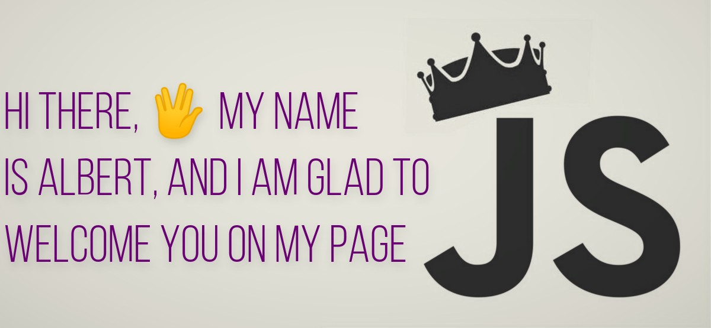

### 
A little more about me: 

 - `🤯 I like learning new technologies`
 - `🤝 I like to work in a team.`
 - `⚽ I love football, and videogames 🎮`

### I spend my free time on

### and learn Typescript

### Languages and Tools:
### 

<!--  -->

<!--  -->

<!--  -->

<!--  -->

